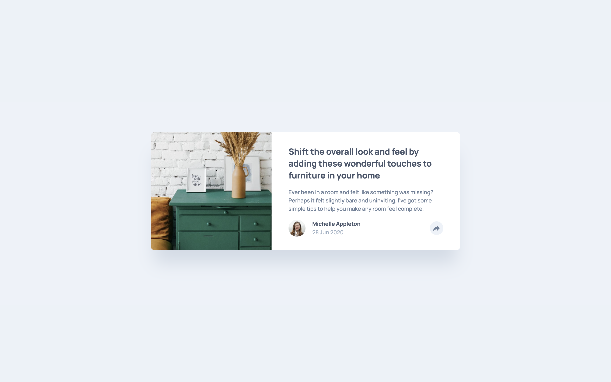

# Frontend Mentor - Article preview component solution

This is a solution to the [Article preview component challenge on Frontend Mentor](https://www.frontendmentor.io/challenges/article-preview-component-dYBN_pYFT). Frontend Mentor challenges help you improve your coding skills by building realistic projects. 

## Table of contents

- [Overview](#overview)
  - [The challenge](#the-challenge)
  - [Screenshot](#screenshot)
  - [Links](#links)
- [My process](#my-process)
  - [Built with](#built-with)
  - [What I learned](#what-i-learned)
  - [Continued development](#continued-development)
  - [AI Collaboration](#ai-collaboration)
- [Author](#author)

## Overview

### The challenge

Users should be able to:

- View the optimal layout for the component depending on their device's screen size
- See the social media share links when they click the share icon

### Screenshot



### Links

- [Solution URL](https://github.com/tea-leaves00/article-preview-component)
- [Live Site URL](https://github.com/tea-leaves00/article-preview-component)

## My process

### Built with

- Semantic HTML5 markup
- CSS custom properties
- Flexbox
- CSS Grid
- Mobile-first workflow
- BEM naming convention
- Vanilla JavaScript

### What I learned

This was my first Frontend Mentor challenge with any JavaScript, and the main lesson was how little JS you need when the CSS does the heavy lifting.

**Letting `aria-expanded` drive the styling.** Instead of toggling a class, the share button's `aria-expanded` attribute is the single source of truth. The JS only flips that attribute:

```js
const shareBtn = document.querySelector(".share-btn");

shareBtn.addEventListener("click", () => {
  const isOpen = shareBtn.getAttribute("aria-expanded") === "true";
  shareBtn.setAttribute("aria-expanded", String(!isOpen));
});
```

The CSS uses `:has()` to react to it, so the button's state can style its parent and siblings:

```css
.card__footer:has(.share-btn[aria-expanded="true"]) .share-menu {
  display: flex;
}
```

Screen readers announce the expanded or collapsed state for free, and the visual state and the accessible state can't get out of sync.

**Skipping `overflow: hidden` on the card.** Normally I'd use it to clip the image to the card's rounded corners. Here, the desktop share popup hangs outside the card, so `overflow: hidden` would cut it off. Instead, the image and the footer round their own corners.

**Padding the children instead of the parent.** On mobile, the open share bar has to reach the full width of the card. I put the side padding on each direct child instead of on the content wrapper, which avoids negative margins:

```css
.card__content > * {
  padding-inline: 2rem;
}
```

### Continued development

- **Interaction details:** closing the share menu when you click outside it or press Escape.
- **Hover and `:focus-visible` states:** adding them for the share button and the social links.
- **Writing more of the CSS layout myself** before reaching for help, especially positioning.

### AI Collaboration

I used **Claude Code** throughout this project as a pair programmer and tutor.

**How I used it**
- **HTML review:** checked my first-pass HTML for semantics and accessibility. It suggested `<article>`, `<footer>` and a real `<button>` for the share icon, empty `alt` text on decorative images, and `aria-expanded`/`aria-controls` on the button.
- **CSS foundations:** generated a starting point for the `:root` variables (from the style guide) and a minimal CSS reset. I then trimmed both down to what I wanted.
- **BEM classes:** added BEM class names to the markup.
- **CSS, one section at a time:** walked through the styles one section at a time (card, image, content, author, share menu). It explained each choice, and I asked questions and decided between approaches before it wrote the code.
- **Checking against the design:** took headless Chrome screenshots to compare my build against the design files.
- **Git:** handled conventional commits along the way.
- **Learning notes:** wrote a CSS notes file explaining the reasoning behind every rule, so I could review and understand it afterwards.

**What worked well**
- Working in small steps, asking "what do you think?" before having it write anything, kept me in control of the decisions.
- Asking it to explain trade-offs (flex vs. grid for centering, `max-width` vs. `width`, `:has()` vs. toggling a class) taught me more than just getting code.

**What didn't**
- **One suggestion fell short:** its first idea for the full-width mobile share bar (just dropping the bottom padding) wouldn't have worked. It caught that and switched to the child-padding approach.
- **I had to check its estimates:** some values, like the heading size and the shadow, are its estimates from the design images rather than exact specs.
- **I still have to study it:** I want to write more of the CSS myself next time, instead of mostly reviewing it.

## Author

- Frontend Mentor - [@tea-leaves00](https://www.frontendmentor.io/profile/tea-leaves00)
- GitHub - [@tea-leaves00](https://github.com/tea-leaves00)
